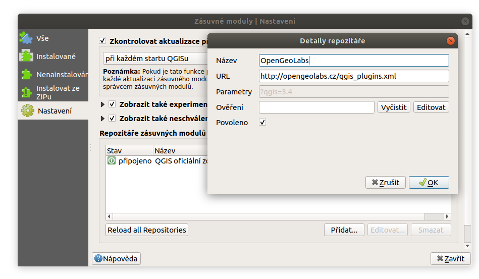
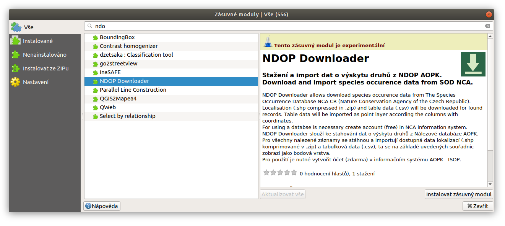
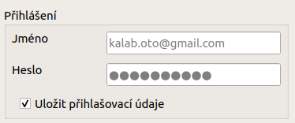

# NDOP Downloader  

NDOP Downloader je aplikace, která slouží ke stahování nálezů z
[Nálezové databáze ochrany přírody AOPK ČR](https://cs.wikipedia.org/wiki/N%C3%A1lezov%C3%A1_datab%C3%A1ze_ochrany_p%C5%99%C3%ADrody).
Aplikace je dostupná ve dvou formách, jako **QGIS zásuvný modul**, jehož
základ tvoří Python balíček *ndop-downloader* s nástrojem příkazové řádky **ndop**.

NDOP Downloader pouze zprostředkovává přístup k datům. Veškeré informace
o datech - fungování databáze, licenční podmínky, citační pravidla týkající
se dat naleznete na stránkách
[Nálezové databáze](https://portal.nature.cz/nd/).

**Pro použití** databáze je **nutné
[vytvořit účet](https://idm.nature.cz/idm/#/registration)** v informačním
systému AOPK (ISOP).

### Hlavní výhody oproti webovému filtru:

- snadný přístup k datům přímo z QGIS nebo Python
- automatická kompletace tabulkových dat ke všem vyhledaným záznamům
- možnost filtrování na základě polygonu z vrstvy (zatím pouze u Python modulu)
    - zadaná oblast je bez limitu 25 km<sup>2</sup> 

### Nevýhoda:

- omezené možnosti filtru u QGIS zásuvného modulu (zatím)

# Obsah

[QGIS Plugin - NDOP Downloader](https://github.com/OpenGeoLabs/qgis-ndop-downloader#QGIS-Plugin---NDOP-Downloader)
- [Instalace a Spouštění](https://github.com/OpenGeoLabs/qgis-ndop-downloader#Instalace-a-Spousteni)  
- [Popis rozhraní](https://github.com/OpenGeoLabs/qgis-ndop-downloader#Popis-rozhrani)  
- [Průběh stahování](https://github.com/OpenGeoLabs/qgis-ndop-downloader#Prubeh-stahovani)  
- [Plánované funkce - zpětná vazba](https://github.com/OpenGeoLabs/qgis-ndop-downloader#planovane-funkce---zpetna-vazba) 

[Python balíček - ndop-downloader](https://github.com/OpenGeoLabs/qgis-ndop-downloader#Python-balicek---NDOP-Downloader)
- [Python balíček lze také stánout zcela samostatně z [PyPi]](https://github.com/OpenGeoLabs/qgis-ndop-downloader#python-bal%C3%AD%C4%8Dek-lze-tak%C3%A9-st%C3%A1nout-zcela-samostatn%C4%9B-z-pypi)

[Licence](https://github.com/OpenGeoLabs/qgis-ndop-downloader#licence)

[Reference](https://github.com/OpenGeoLabs/qgis-ndop-downloader#reference)


## QGIS Plugin - NDOP Downloader
Zásuvný modul slouží ke stahování dat z nálezové databáze AOPK. V
současné verzi je možné filtrovat na základě taxonu (druh,popř. rod)
a definovaných regionů (katastrální území, CHKO, PP, atd.).

Výstupem jsou dostupná data lokalizací (.shp komprimované v .zip)
a tabulková data (.csv) pro všechny záznamy. Lokalizace se po ukončení
stahování nahrají do projektu. Tabulková data se nahrají do projektu
jako `Oddělený text` a zobrazí se jako body (na základě souřadnic v
tabulce). Tato data obsahují body a centroidy většiny polygonů a linií.


### Instalace a Spouštění

Zásuvný modul předpokládá verzi LTR QGIS 3.4. Instaluje se jako ostatní
moduly pomocí menu `Zásuvné moduly --> Spravovat a instalovat zásuvné moduly`.
Je ale nutné přidat externí repozitář OpneGeoLabs. V záložce nastavení klikneme
na tlačítko `Přidat...` a zadáme adresu:

    http://opengeolabs.cz/qgis_plugins.xml
    


Aktualizujeme seznam modulů tlačítkem `Reload repository`. Nyní už uvidíme
zásuvný modul mezi ostatními v záložce `Nenainstalované` (nebo `Vše`.
Vyhledáme `NDOP Downloader`, a nainstalujeme pomocí tlačítka
`Instalvoat zásuvný modul`



Po instalaci se přidá do menu `Web` položka `NDOP Downloader`
a pro rychlé spuštění se objeví ikonka v liště.

#### Instalace vývojové verze

Zájemci si mohou stáhnout i [vývojovou verzi](https://github.com/OpenGeoLabs/qgis-ndop-downloader/archive/master.zip), a
nainstalovat pomocí záložky `Instalovat ze ZIPu` v okně `Zásuvné moduly`. Tato verze
obsahuje nejčerstvější opravy a funkce, ale může obsahovat chyby, vnesené v
průběhu dalšího vývoje.

### Popis rozhraní


#### Přihlášení

Zadejte přihlašovací údaje pro informačním systém AOPK (ISOP). Pokud
zaškrtnete položku `Uložit přihlašovací údaje`, údaje se uloží do
konfiguračního souboru `.ndop.cfg` v domovském adresáři, a při dalším
použití budou předvyplněny. V opačném případě budou údaje uložené pouze
v rámci běžící instance QGIS, při dalším spuštění QGIS je bude potřeba
zadat znovu.



#### Taxon

Druh lze vybrat pomocí rolovací nabídky, nebo vepsáním názvu s funkcí
našeptávače. Lze zadávat česká i latinská jména.

   

#### Region

Obdobně jako u taxonu. V případě že položka zůstane nevyplněná, získáme
data z clého území ČR. Naopak, pokud vybyreme území regionu a necháme
prázdné políčko taxonu, získáme data všech taxonů ve vybraném regionu.


#### Výstupní složka

Vybereme výsupní složku kam se nám data uloží. Pokud ponecháme prázdné,
stáhnou se data do složky dočasných souborů. V případě, že nechceme
stahovat tabulková data zaškrtneme možnost `Nestahovat tabulková data`.

Stažené soubory se nahrají do projektu a ponesou název odvozený od
použitého filtru a typu dat.

Příklad:

- `Mantis_religiosa_shp_b` - bodová vrstva (.shp)
- `Mantis_religiosa_shp_p` - polygonová vrstva (.shp)
- `Mantis_religiosa_shp_l` - liniová vrstva (.shp)
- `Mantis_religiosa_tab` - tabulková data (.csv), v projektu se zobrazí
body (souřadnice ze sloupečků `X` a `Y`)

Pokud je do filtru zadán taxon, bude název odvozen od názvu druhu. Poukd
filtrujeme pouze podle regionu bude název odvozen od názvu regionu.

### Průběh stahování

Po potvrzení tlačítkem `Ok` se okno zavře a spustí se filtrace a
stahování. QGIS během stahování **nelze v současné době používat**.
Stejně jako při použití oficiálního webové filtru, stahování může trvat
několik minut, v závislosti na počtu záznamů, stažení tabulkových dat atd.


V informačním panelu v horní části obrazovky uvidíte informace o průběhu
stahování. Při stahování se také vypíše počet záznamů a hrubý odhad doby
trvání konkrétního kroku. Po úspěšném stažení se objeví zelený panel s
odkazem na složku kam byla data stažena.


### Plánované funkce - zpětná vazba

Výběr plánovaných funkcí:

- zadání oblasti tažením a použítím polygonu z vrstvy
- přidání filtru druhové ochrany
- automatické vytvoření relace tabulkových dat a lokalizací (1:n)

seznam aktuálně plánovaných funkcí [zde](https://github.com/OpenGeoLabs/qgis-ndop-downloader/issues?q=is%3Aopen+is%3Aissue+label%3Aenhancement) 

Pro připomínky, nápady a hlášení chyb můžete napsat email nebo použít [issues projektu na GitHub ](https://github.com/OpenGeoLabs/qgis-ndop-downloader/issues).

## Python balíček - ndop-downloader

Pro stahování dat lze využít nástroj příkazové řádky **ndop** , který
se nainstaluje se zásuvným modulem do složky `bin/ndop`. Tento nástroj
má více možností filtrů (viz nápověda modulu), a mimo jiné umožňuje
stahování na základě polygonové vrstvy (vezme první polygon z vrstvy).
Přihlašovací údaje lze zadat přímo do příkazu  (`--user`, `--password`),
nebo je načíst z konfiguračního souboru `.ndop.cfg` v domovském adresáři.
Konfigurační soubor lze nechat vygenerovat použitím argumentu `-s`.
Nástroj lze spustit z adresáře QGIS pluginu:

nápověda:

    python3 bin/ndop -h

použití:

    python3 bin/ndop --taxon "mantis religiosa"

### Python balíček lze také stánout zcela samostatně z [PyPi](https://pypi.org/project/ndop-downloader/):
 
    pip3 install ndop-downloader

Poté můžeme rovnou spustit:

    ndop --taxon "mantis religiosa"

Nebo naimportovat modul do vlastního skriptu pomocí:

```python
import ndop
```

Nápověda:

    ndop -h

    usage: ndop [-h] [--user USER] [--password PASSWORD] [-s] [--output OUTPUT]
                [-loc_only] [--taxon TAXON] [--region REGION] [--polygon POLYGON]
                [--month_from MONTH_FROM] [--month_to MONTH_TO]
                [--date_from DATE_FROM] [--date_to DATE_TO] [--author AUTHOR]
                [--project PROJECT] [--source SOURCE] [--d_source D_SOURCE]
                [--config CONFIG]

    Download data (.csv, .shp) from NDOP based on input parametres. Unlike the
    offical web filter, its possible to input polygon layer for search in area and
    amount of results is not limited. Login can be stored in configuration file
    ".ndop.cfg".

    optional arguments:
      -h, --help            show this help message and exit
      --user USER           login (user name or email)
      --password PASSWORD   ISOP password
      -s                    store login and password in "/home/ok/.ndop.cfg"
      --output OUTPUT       path with output filenames prefix
      -loc_only             downloads only spatial data without tables(faster, but
                            only localisations with id)
      --taxon TAXON         taxon name (i.e. "mantis religiosa")
      --region REGION       region of iterest (i.e. town , protected area)
      --polygon POLYGON     path to poygon layer (EPSG:5514) that define thesearch
                            area. Function takes first feature of the layer
      --month_from MONTH_FROM
                            get data only from a certain month in season (number)
      --month_to MONTH_TO   get data only to a certain month in season (number)
      --date_from DATE_FROM
                            get data from a certain date (d.m.yyyy)
      --date_to DATE_TO     get data only to a certain date (d.m.yyyy)
      --author AUTHOR       author surname and firstname (i.e. "Kaláb Oto")
      --project PROJECT     for data obtained from specific project
      --source SOURCE       general source of data (i.e. "ND - Databáze BioLog")
      --d_source D_SOURCE   specific, more detailed source of data
      --config CONFIG       path to the config file with login and password.
                            Default file path is: "/home/ok/.ndop.cfg"

## Licence

[GNU General Public License v3.0](https://github.com/OpenGeoLabs/qgis-ndop-downloader/blob/master/LICENSE)
## Reference

Kaláb. O. (2019): NDOP Downloader - QGIS a Python modul, OpenGeoLabs

    @manual{,
      author   = {Oto Kaláb},
      title    = {NDOP Downloader - QGIS a Python modul},
      year     = {2019},
      organization = {OpenGeoLabs},
      url      = {https://github.com/OpenGeoLabs/qgis-ndop-downloader},
      keywords = {QGIS, Python, ecology, AOPK, species occurrence},
    }

Pro citaci použitých dat postupujte podle [Citačních pravidlel ND](https://portal.nature.cz/publik_syst/ctihtmlpage.php?what=4910&X=X)
