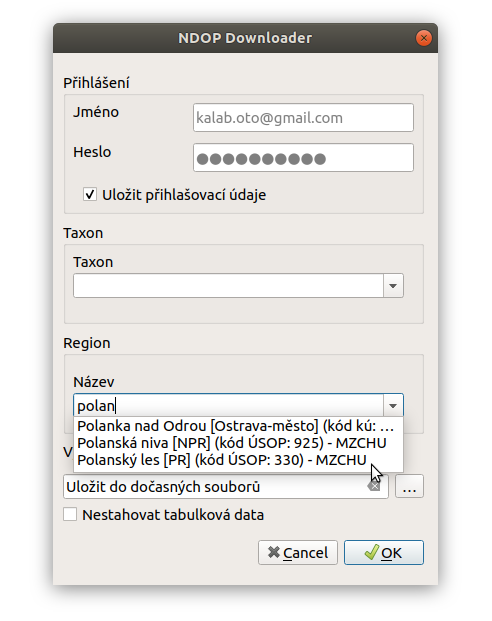

# NDOP Downloader

NDOP Downloader je aplikace, která slouží ke stahování nálezů z Nálezové
Databáze Agentury ochrany přírody a krajiny ČR ([AOPK NDOP](https://portal.nature.cz/nd/))
. Aplikace je dostupná ve dvou formách, jako **QGIS zásuvný modul** jehož
základ tvoří samostatný Python modul s **nástrojem příkazové řádky**.

NDOP Downloader pouze zprostředkovává přístup k datům. Veškeré informace
o datech - fungování databáze, licenční podmínky, citační pravidla týkající
se dat naleznete na portálu
[ISOP](https://portal.nature.cz/publik_syst/ctihtmlpage.php?what=1021&nabidka=rozbalitModul&modulID=21)
.

**Pro použití** databáze je **nutné
[vytvořit účet](https://idm.nature.cz/idm/#/registration)** v informačním
systému AOPK (ISOP).

## QGIS Plugin - NDOP Downloader
Zásuvný modul slouží ke stahování dat z nálezové databáze AOPK. V
současné verzi je možné filtrovat na základě taxonu (druh,popř. rod)
a definovaných regionů (katastrální území, CHKO, PP, atd.).

Výstupem jsou dostupná data lokalizací (.shp komprimované v .zip)
a tabulková data (.csv) pro všechny záznamy. Lokalizace se po ukončení
stahování nahrají do projektu. Tabulková data se nahrají do projektu
jako `Oddělený text` a zobrazí se jako body (na základě souřadnic v
tabulce). Tato data obsahují body a centroidy většiny polygonů a linií.

### Instalace a Spouštění

Zásuvný modul předpokládá verzi LTR QGIS 3.4. Instaluje se jako ostatní
moduly pomocí menu `Zásuvné moduly --> Spravovat a instalovat zásuvné moduly`.
Je ale nutné přidat externí repozitář OpneGeoLabs. V záložce nastavení klikneme
na tlačítko `Přidat...` a zadáme adresu:

    adresa k repozitáři

    screenshot

Aktualizujeme seznam modulů tlačítkem `Reload repository`. Nyní už uvidíme
zásuvný modul mezi ostatními v záložce `Nenainstalované` (nebo `Vše`.
Vyhledáme `NDOP Downloader`, a nainstalujeme pomocí tlačítka
`Instalvoat zásuvný modul`

    screenshot

Po instalaci se přidá do menu `Zásuvné moduly` položka `NDOP Downloader`
a pro rychlé spuštění se objeví ikonka v liště.

### Popis rozhraní

#### Přihlášení

Zadejte přihlašovací údaje pro informačním systém AOPK (ISOP). Pokud
zaškrtnete položku `Uložit přihlašovací údaje`, údaje se uloží do
konfiguračního souboru a při dalším použití budou předvyplněny. V opačném
případě budou údaje uložené pouze v rámci běžící instance QGIS, při dalším
spuštění QGIS je bude potřeba zadat znovu.

    obrázek předvyplněých údajů

#### Taxon

Druh lze vybrat pomocí rolovací nabídky, nebo vepsáním názvu s funkcí
našeptávače. Lze zadávat česká i latinská jména.

   

#### Region

Obdobně jako u taxonu. V případě že položka zůstane nevyplněná, získáme
data z clého území ČR. Naopak, pokud vybyreme území regionu a necháme
prázdné políčko taxonu, získáme data všech taxonů ve vybraném regionu.

#### Výstupní složka

Vybereme výsupní složku kam se nám data uloží. Pokud ponecháme prázdné,
stáhnou se data do složky dočasných souborů. V případě, že nechceme
stahovat tabulková data zaškrtneme možnost `Nestahovat tabulková data`.

Stažené soubory se nahrají do projektu a ponesou název odvozený od
použitého filtru a typu dat.

Příklad:

- `Mantis_religiosa_shp_b` - bodová vrstva (.shp)
- `Mantis_religiosa_shp_p` - polygonová vrstva (.shp)
- `Mantis_religiosa_shp_l` - liniová vrstva (.shp)
- `Mantis_religiosa_tab` - tabulková data (.csv), v projektu se zobrazí
body (souřadnice ze sloupečků `X` a `Y`)

Pokud je do filtru zadán taxon, bude název odvozen od názvu druhu. Poukd
filtrujeme pouze podle regionu bude název odvozen od názvu regionu.

### Průběh stahování

Po potvrzení tlačítkem `Ok` se okno zavře a spustí se filtrace a
stahování. QGIS během stahování **nelze v současné době používat**.
Stejně jako při použití oficiální webové aplikace, stahování může trvat
několik minut, v závislosti na počtu záznamů, stažení tabulkových dat atd.

V informačním panelu v horní části obrazovky uvidíte informace o průběhu
stahování. Při stahování se také vypíše počet záznamů a hrubý odhad doby
trvání konkrétního kroku. Po úspěšném stažení se objeví zelený panel s
odkazem na složku kam byla data stažena.

### Plánované funkce - zpětná vazba

Výběr plánovaných funkcí:

- zadání oblasti tažením a použítím polygonu z vrstvy
- přidání filtru druhové ochrany
- automatické vytvoření relace tabulkových dat a lokalizací (1:n)

seznam aktuálně plánovaných funkcí [zde](https://github.com/OpenGeoLabs/qgis-ndop-downloader/issues?q=is%3Aopen+is%3Aissue+label%3Aenhancement) 

Pro připomínky, nápady a hlášení chyb můžete napsat email nebo použít [issues projektu na GitHub ](https://github.com/OpenGeoLabs/qgis-ndop-downloader/issues).

## Nástroj příkazové řádky ndop

Pro dávkové zpracování lze využít Python nástroj příkazové řádky **ndop**

    python3 bin/ndop -h
    
    python3 bin/ndop --taxon "lynx lynx"

...
## Licence
...
## Reference
...
