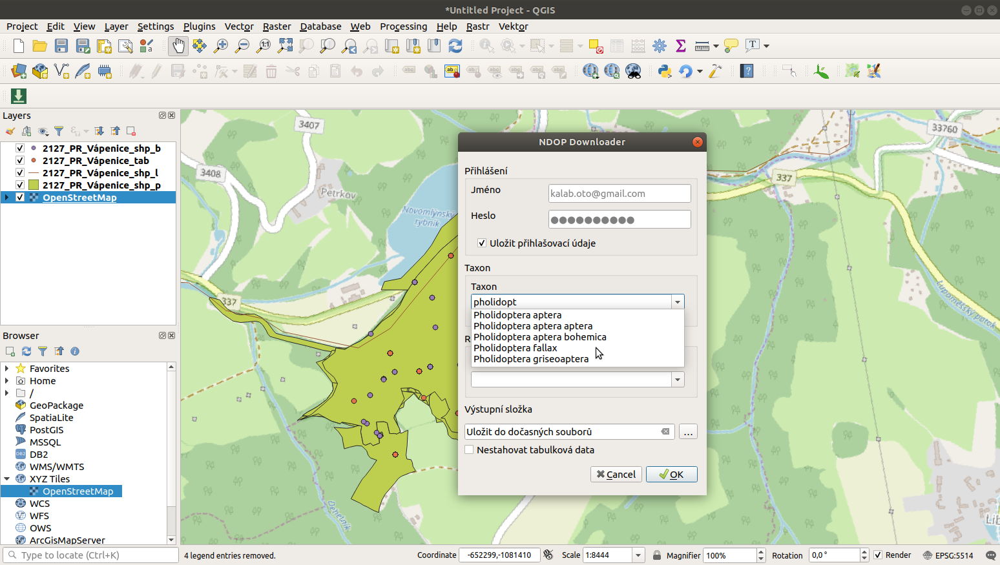

.. NDOPDownloader documentation master file, created by
   sphinx-quickstart on Sun Feb 12 17:11:03 2012.
   You can adapt this file completely to your liking, but it should at least
   contain the root `toctree` directive.

NDOP Downloader 
================

NDOP Downloader je aplikace, která slouží ke stahování nálezů z
`Nálezové databáze ochrany přírody AOPK
ČR <https://cs.wikipedia.org/wiki/N%C3%A1lezov%C3%A1_datab%C3%A1ze_ochrany_p%C5%99%C3%ADrody>`__.
Aplikace je dostupná ve dvou formách, jako **QGIS zásuvný modul**, jehož
základ tvoří Python balíček *ndop-downloader* s nástrojem příkazové
řádky **ndop**.

NDOP Downloader pouze zprostředkovává přístup k datům. Veškeré informace
o datech - fungování databáze, licenční podmínky, citační pravidla
týkající se dat naleznete na stránkách `Nálezové
databáze <https://portal.nature.cz/nd/>`__.

**Pro použití** databáze je **nutné `vytvořit
účet <https://idm.nature.cz/idm/#/registration>`__** v informačním
systému AOPK (ISOP).

Hlavní výhody oproti webovému filtru:
-------------------------------------

-  snadný přístup k datům přímo z QGIS nebo Python
-  automatická kompletace tabulkových dat ke všem vyhledaným záznamům
-  možnost filtrování na základě polygonu z vrstvy (zatím pouze u Python
   modulu)

   -  zadaná oblast je bez limitu 25 km2

Nevýhoda:
---------

-  omezené možnosti filtru u QGIS zásuvného modulu (zatím)

QGIS Plugin - NDOP Downloader
-----------------------------

Zásuvný modul slouží ke stahování dat z nálezové databáze AOPK. V
současné verzi je možné filtrovat na základě taxonu (druh,popř. rod) a
definovaných regionů (katastrální území, CHKO, PP, atd.).

Výstupem jsou dostupná data lokalizací (.shp komprimované v .zip) a
tabulková data (.csv) pro všechny záznamy. Lokalizace se po ukončení
stahování nahrají do projektu. Tabulková data se nahrají do projektu
jako ``Oddělený text`` a zobrazí se jako body (na základě souřadnic v
tabulce). Tato data obsahují body a centroidy většiny polygonů a linií.

Contents:

.. toctree::
   :maxdepth: 2
   
   instalace
   rozhrani
   stahovani
   

Indices and tables
==================

* :ref:`genindex`
* :ref:`modindex`
* :ref:`search`

