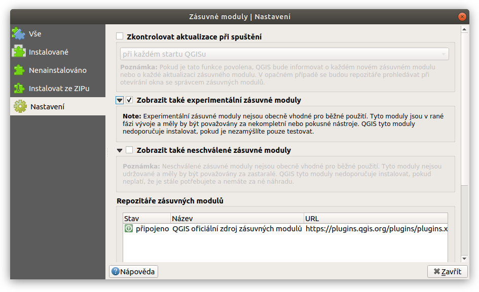
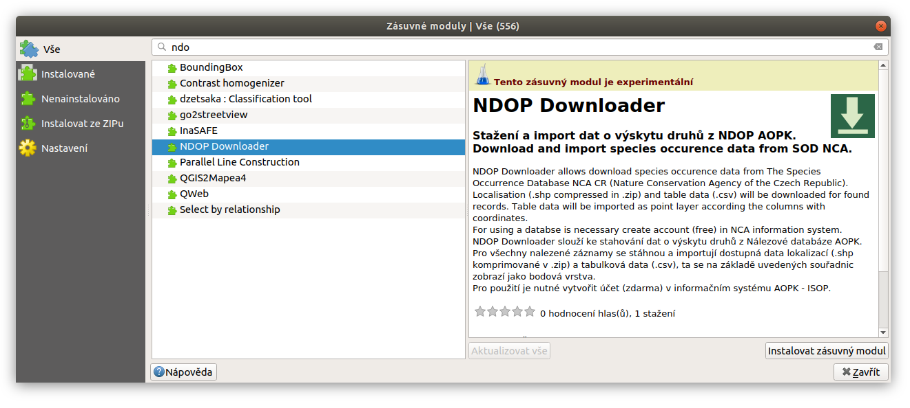

Instalace a Spouštění
~~~~~~~~~~~~~~~~~~~~~

Zásuvný modul předpokládá verzi LTR QGIS 3.4. Instaluje se jako ostatní
moduly pomocí menu
``Zásuvné moduly --> Spravovat a instalovat zásuvné moduly``. Je ale
nutné povolit experimentální zásuvné moduly. V záložce nastavení
zaškrtneme políčko ``Zobrazit také experimentální zásuvné moduly``.

Nyní už uvidíme zásuvný modul mezi ostatními v záložce
``Nenainstalované`` (nebo ``Vše``.Vyhledáme ``NDOP Downloader``, a
nainstalujeme pomocí tlačítka ``Instalvoat zásuvný modul``.

Po instalaci se přidá do menu ``Web`` položka ``NDOP Downloader`` a pro
rychlé spuštění se objeví ikonka v liště.

Instalace vývojové verze
^^^^^^^^^^^^^^^^^^^^^^^^

Zájemci si mohou stáhnout i `vývojovou
verzi <https://github.com/OpenGeoLabs/qgis-ndop-downloader/archive/master.zip>`__,
a nainstalovat pomocí záložky ``Instalovat ze ZIPu`` v okně
``Zásuvné moduly``. Tato verze obsahuje nejčerstvější opravy a funkce,
ale může obsahovat chyby, vnesené v průběhu dalšího vývoje.
