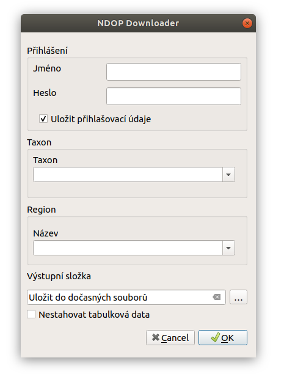
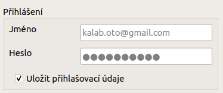
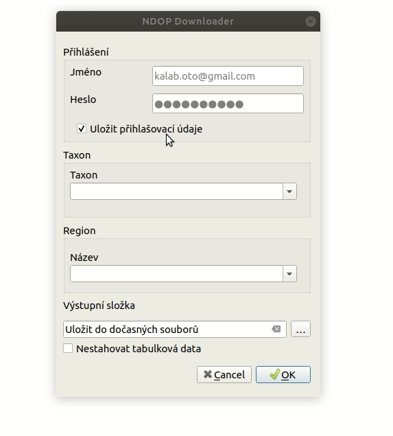
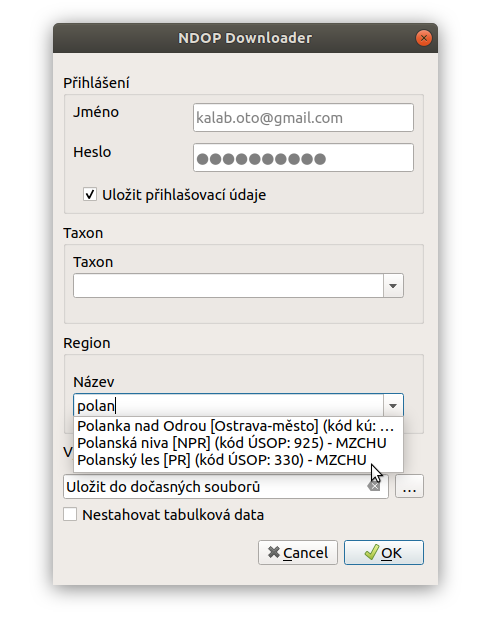

Popis rozhraní
~~~~~~~~~~~~~~

Přihlášení
^^^^^^^^^^

Zadejte přihlašovací údaje pro informačním systém AOPK (ISOP). Pokud
zaškrtnete položku ``Uložit přihlašovací údaje``, **údaje se uloží do
konfiguračního souboru ``.ndop.cfg`` v domovském adresáři**, a při
dalším použití budou předvyplněny. V opačném případě budou údaje uložené
pouze v rámci běžící instance QGIS, při dalším spuštění QGIS je bude
potřeba zadat znovu.

Taxon
^^^^^

Druh lze vybrat pomocí rolovací nabídky, nebo vepsáním názvu s funkcí
našeptávače. Lze zadávat česká i latinská jména.

Region
^^^^^^

Obdobně jako u taxonu. V případě že položka zůstane nevyplněná, získáme
data z clého území ČR. Naopak, pokud vybyreme území regionu a necháme
prázdné políčko taxonu, získáme data všech taxonů ve vybraném regionu.

Výstupní složka
^^^^^^^^^^^^^^^

Vybereme výsupní složku kam se nám data uloží. Pokud ponecháme prázdné,
stáhnou se data do složky dočasných souborů. V případě, že nechceme
stahovat tabulková data zaškrtneme možnost
``Nestahovat tabulková data``.

Stažené soubory se nahrají do projektu a ponesou název odvozený od
použitého filtru a typu dat.

Příklad:

-  ``Mantis_religiosa_shp_b`` - bodová vrstva (.shp)
-  ``Mantis_religiosa_shp_p`` - polygonová vrstva (.shp)
-  ``Mantis_religiosa_shp_l`` - liniová vrstva (.shp)
-  ``Mantis_religiosa_tab`` - tabulková data (.csv), v projektu se
   zobrazí body (souřadnice ze sloupečků ``X`` a ``Y``)

Pokud je do filtru zadán taxon, bude název odvozen od názvu druhu. Poukd
filtrujeme pouze podle regionu bude název odvozen od názvu regionu.
