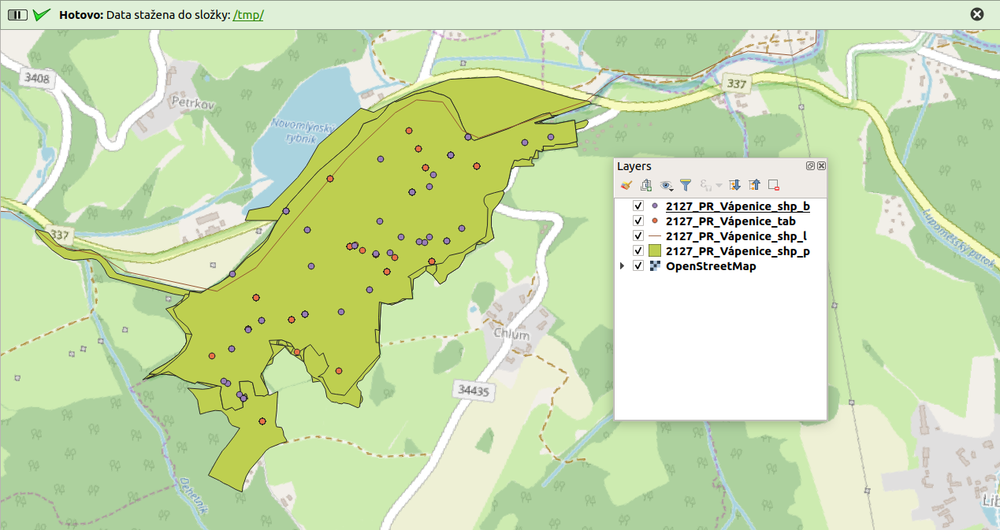

Průběh stahování
~~~~~~~~~~~~~~~~

Po potvrzení tlačítkem ``Ok`` se okno zavře a spustí se filtrace a
stahování. QGIS během stahování **nelze v současné době používat**.
Stejně jako při použití oficiálního webové filtru, stahování může trvat
několik minut, v závislosti na počtu záznamů, stažení tabulkových dat
atd.

V informačním panelu v horní části obrazovky uvidíte informace o průběhu
stahování. Při stahování se také vypíše počet záznamů a hrubý odhad doby
trvání konkrétního kroku. Po úspěšném stažení se objeví zelený panel s
odkazem na složku kam byla data stažena.

